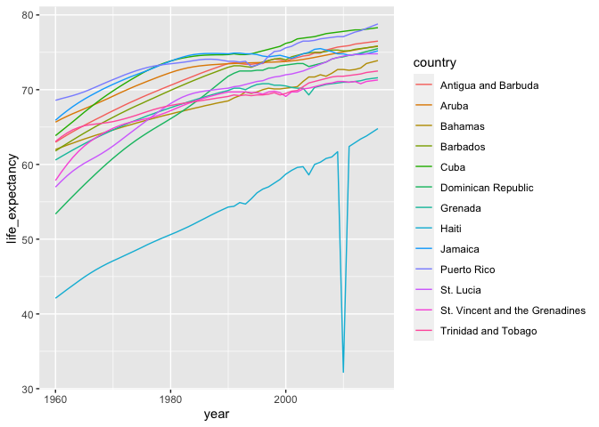
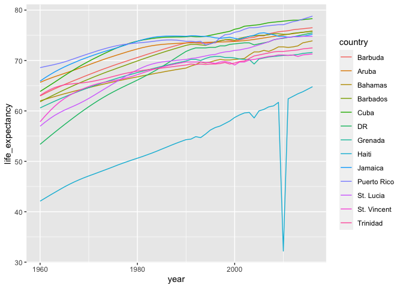

Recoding.R
================
werner
2020-10-23

``` r
# Another common operation involving strings is recoding the names of categorical variables.
# Let’s say you have really long names for your levels and you will be displaying them in 
# plots, you might want to use shorter versions of these names. 
# For example, in character vectors with country names, you might want to change 
# “United States of America” to “USA” and “United Kingdom” to UK, and so on. 
# We can do this with case_when, although the tidyverse offers an option that is 
# specifically designed for this task: the recode function.

library(dslabs)
data("gapminder")
colnames(gapminder)
```

    ## [1] "country"          "year"             "infant_mortality" "life_expectancy"  "fertility"       
    ## [6] "population"       "gdp"              "continent"        "region"

``` r
gapminder %>%
  filter(region == 'Caribbean') %>%
  ggplot(aes(year, life_expectancy, color = country)) +
  geom_line()
```

<!-- -->

``` r
gapminder %>% filter(region=='Caribbean') %>%
  mutate(country=recode(country,
                        'Antigua and Barbuda' = 'Barbuda',
                        'Dominican Republic' = 'DR',
                        'St. Vincent and the Grenadines' = 'St. Vincent',
                        'Trinidad and Tobago' = 'Trinidad')) %>%
  ggplot(aes(year, life_expectancy,color=country)) +
  geom_line()
```

<!-- -->

``` r
gapminder %>% filter(region == 'Caribbean' & year == min(year)) %>%
  summarize(country, year)
```

    ##                           country year
    ## 1             Antigua and Barbuda 1960
    ## 2                           Aruba 1960
    ## 3                         Bahamas 1960
    ## 4                        Barbados 1960
    ## 5                            Cuba 1960
    ## 6              Dominican Republic 1960
    ## 7                         Grenada 1960
    ## 8                           Haiti 1960
    ## 9                         Jamaica 1960
    ## 10                    Puerto Rico 1960
    ## 11                      St. Lucia 1960
    ## 12 St. Vincent and the Grenadines 1960
    ## 13            Trinidad and Tobago 1960
