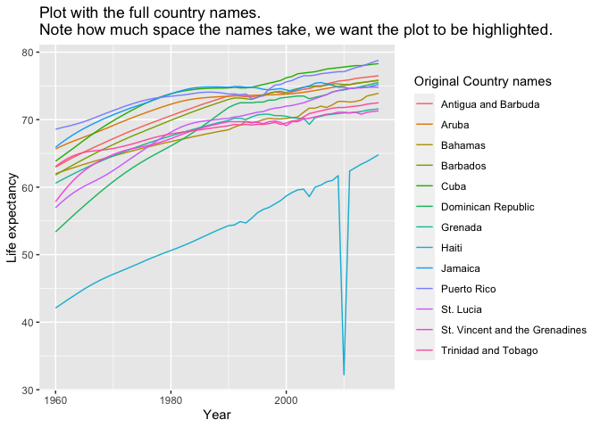
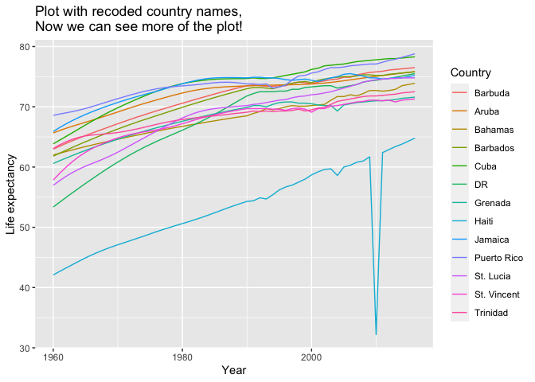

Report on Life Expectancy in the Caribbean
================
Werner Dassuncao
2020-10-24

## Introduction

As practice string exercise I will apply recoding of names of
categorical variables.

The original data is available from the ‘dslabs’ package on CRAN. The
name of the dataset is ‘gapminder’.

The objective is to replace(recode) the long names for the levels and to
be displayed in plots, by using the ‘recode’ function available.

For example, in character vectors with country names, you might want to
change “United States of America” to “USA” and “United Kingdom” to UK,
and so on.

We can do this with case\_when, although the tidyverse offers an option
that is specifically designed for this task: the **recode** function.

<p>

 

</p>

<p>

 

</p>

We will use the gapminder dataset available in the dslabs library:

``` r
library(tidyverse)
library(dslabs)
```

<p>

 

</p>

Loading the gapminder dataset:

``` r
data("gapminder")
```

<p>

 

</p>

These are the column names:

``` r
colnames(gapminder)
```

    ## [1] "country"          "year"             "infant_mortality" "life_expectancy" 
    ## [5] "fertility"        "population"       "gdp"              "continent"       
    ## [9] "region"

<p>

 

</p>

Bellow we can see the countries in the Caribbean and their earliest life
expectancy and year:

``` r
gapminder %>% filter(region == 'Caribbean' & year == min(year)) %>%
  summarize(country, year, life_expectancy)
```

    ##                           country year life_expectancy
    ## 1             Antigua and Barbuda 1960           62.97
    ## 2                           Aruba 1960           65.66
    ## 3                         Bahamas 1960           62.00
    ## 4                        Barbados 1960           61.80
    ## 5                            Cuba 1960           63.85
    ## 6              Dominican Republic 1960           53.37
    ## 7                         Grenada 1960           60.59
    ## 8                           Haiti 1960           42.10
    ## 9                         Jamaica 1960           65.91
    ## 10                    Puerto Rico 1960           68.58
    ## 11                      St. Lucia 1960           56.97
    ## 12 St. Vincent and the Grenadines 1960           57.85
    ## 13            Trinidad and Tobago 1960           63.07

<p>

 

</p>

Filtering the data to grab the Caribbean region, and generating a plot
with colored lines for each country:

``` r
gapminder %>%
  filter(region == 'Caribbean') %>%
  ggplot(aes(year, life_expectancy, color = country)) +
  ggtitle('Plot with the full country names.\nNote how much space the names take, we want the plot to be highlighted.') +
  labs(x ='Year', y ='Life expectancy', color ='Original Country names') +
  geom_line()
```

<!-- -->

<p>

 

</p>

Now we will recode with shorter versions of the longer country names:

``` r
gapminder %>% filter(region=='Caribbean') %>%
  mutate(country=recode(country,
                        'Antigua and Barbuda' = 'Barbuda',
                        'Dominican Republic' = 'DR',
                        'St. Vincent and the Grenadines' = 'St. Vincent',
                        'Trinidad and Tobago' = 'Trinidad')) %>%
  ggplot(aes(year, life_expectancy,color=country)) +
  ggtitle('Plot with recoded country names,\nNow we can see more of the plot!') +
  labs(x ='Year', y ='Life expectancy', color ='Country') +
  geom_line()
```

<!-- -->
