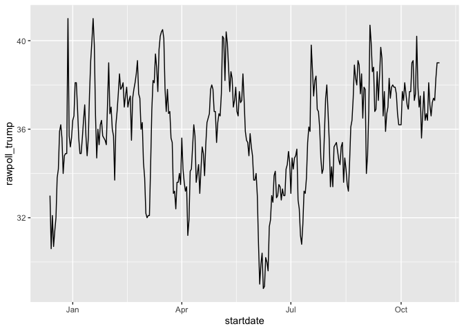

Section 4: Dates, Times and Text Mining
================
Werner Dassuncao
26 October, 2020.

Key points   Dates are a separate data type in R.The tidyverse includes
functionality for dealing with dates through the lubridate package.

Extract the year, month and day from a date object with the year(),
month() and day() functions.

Parsers convert strings into dates with the standard **YYYY-MM-DD**
format (ISO 8601 format). Use the parser with the name corresponding to
the string format of year, month and day (ymd(), ydm(), myd(), mdy(),
dmy(), dym()).

Get the current time with the Sys.time() function. Use the now()
function instead to specify a time zone.

You can extract values from time objects with the hour(), minute() and
second() functions.

Parsers convert strings into times (for example, hms()). Parsers can
also create combined date-time objects (for example, mdy\_hms()).  

``` r
# inspect the startdate column of 2016 polls data, a Date type
library(tidyverse)
```

    ## ── Attaching packages ─────────────────────────────────────── tidyverse 1.3.0 ──

    ## ✓ ggplot2 3.3.2     ✓ purrr   0.3.4
    ## ✓ tibble  3.0.4     ✓ dplyr   1.0.2
    ## ✓ tidyr   1.1.2     ✓ stringr 1.4.0
    ## ✓ readr   1.4.0     ✓ forcats 0.5.0

    ## ── Conflicts ────────────────────────────────────────── tidyverse_conflicts() ──
    ## x dplyr::filter() masks stats::filter()
    ## x dplyr::lag()    masks stats::lag()

``` r
library(dslabs)
data("polls_us_election_2016")
polls_us_election_2016$startdate %>% head
```

    ## [1] "2016-11-03" "2016-11-01" "2016-11-02" "2016-11-04" "2016-11-03"
    ## [6] "2016-11-03"

``` r
class(polls_us_election_2016$startdate)
```

    ## [1] "Date"

``` r
# Unix epoch is 00:00:00 UTC on 1 January 1970, dates are represented as days since epoch:
as.numeric(polls_us_election_2016$startdate) %>% head
```

    ## [1] 17108 17106 17107 17109 17108 17108

``` r
# ggplot is aware of dates
polls_us_election_2016 %>% filter(pollster == "Ipsos" & state =="U.S.") %>%
  ggplot(aes(startdate, rawpoll_trump)) +
  geom_line()
```

<!-- -->

``` r
# lubridate: the tidyverse date package
library(lubridate)
```

    ## 
    ## Attaching package: 'lubridate'

    ## The following objects are masked from 'package:base':
    ## 
    ##     date, intersect, setdiff, union

``` r
# select some random dates from polls
set.seed(2)
dates <- sample(polls_us_election_2016$startdate, 10) %>% sort
dates
```

    ##  [1] "2016-01-19" "2016-08-06" "2016-08-26" "2016-09-09" "2016-09-14"
    ##  [6] "2016-09-16" "2016-09-29" "2016-10-04" "2016-10-12" "2016-10-23"

``` r
# extract month, day, year from date strings
data.frame(date = dates, 
           month = month(dates),
           day = day(dates),
           year = year(dates))
```

    ##          date month day year
    ## 1  2016-01-19     1  19 2016
    ## 2  2016-08-06     8   6 2016
    ## 3  2016-08-26     8  26 2016
    ## 4  2016-09-09     9   9 2016
    ## 5  2016-09-14     9  14 2016
    ## 6  2016-09-16     9  16 2016
    ## 7  2016-09-29     9  29 2016
    ## 8  2016-10-04    10   4 2016
    ## 9  2016-10-12    10  12 2016
    ## 10 2016-10-23    10  23 2016

``` r
month(dates, label = TRUE)    # extract month label
```

    ##  [1] Jan Aug Aug Sep Sep Sep Sep Oct Oct Oct
    ## 12 Levels: Jan < Feb < Mar < Apr < May < Jun < Jul < Aug < Sep < ... < Dec

``` r
# ymd works on mixed date styles
x <- c(20090101, "2009-01-02", "2009 01 03", "2009-1-4",
       "2009-1, 5", "Created on 2009 1 6", "200901 !!! 07")
ymd(x)
```

    ## [1] "2009-01-01" "2009-01-02" "2009-01-03" "2009-01-04" "2009-01-05"
    ## [6] "2009-01-06" "2009-01-07"

``` r
# different parsers extract year, month and day in different orders
x <- "09/01/02"
ymd(x)
```

    ## [1] "2009-01-02"

``` r
mdy(x)
```

    ## [1] "2002-09-01"

``` r
ydm(x)
```

    ## [1] "2009-02-01"

``` r
myd(x)
```

    ## [1] "2001-09-02"

``` r
dmy(x)
```

    ## [1] "2002-01-09"

``` r
dym(x)
```

    ## [1] "2001-02-09"

``` r
now()    # current time in your time zone
```

    ## [1] "2020-10-26 11:33:37 PDT"

``` r
now("GMT")    # current time in GMT
```

    ## [1] "2020-10-26 18:33:37 GMT"

``` r
now() %>% hour()    # current hour
```

    ## [1] 11

``` r
now() %>% minute()    # current minute
```

    ## [1] 33

``` r
now() %>% second()    # current second
```

    ## [1] 37.89319

``` r
# parse time
x <- c("12:34:56")
hms(x)
```

    ## [1] "12H 34M 56S"

``` r
#parse datetime
x <- "Nov/2/2012 12:34:56"
mdy_hms(x)
```

    ## [1] "2012-11-02 12:34:56 UTC"
