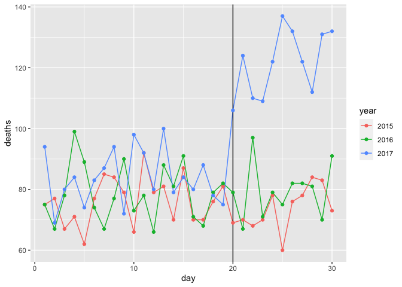

Puerto Rico Mortality hurricane Maria
================
Werner Dassuncao
12 November, 2020

## This report contains my solutions to the questions from the Comprehensive Assessment: Puerto Rico Hurricane Mortality. Data Science: Wrangling - HarvardX PH125.6x

On September 20, 2017, Hurricane María made landfall on Puerto Rico. It
was the worst natural disaster on record in Puerto Rico and the
deadliest Atlantic hurricane since 2004. However, Puerto Rico’s official
death statistics only tallied 64 deaths caused directly by the hurricane
(due to structural collapse, debris, floods and drownings), an
undercount that slowed disaster recovery funding. The majority of the
deaths resulted from infrastructure damage that made it difficult to
access resources like clean food, water, power, healthcare and
communications in the months after the disaster, and although these
deaths were due to effects of the hurricane, they were not initially
counted.

In order to correct the misconception that few lives were lost in
Hurricane María, statisticians analyzed how death rates in Puerto Rico
changed after the hurricane and estimated the excess number of deaths
likely caused by the storm. This analysis External link suggested that
the actual number of deaths in Puerto Rico was 2,975 (95% CI:
2,658-3,290) over the 4 months following the hurricane, much higher than
the original count.

We will use your new data wrangling skills to extract actual daily
mortality data from Puerto Rico and investigate whether the Hurricane
María had an immediate effect on daily mortality compared to unaffected
days in September 2015-2017.

Note: This project is only available for verified learners. If you have
not paid for a certificate in this course, you will be offered an
opportunity to upgrade instead of seeing the problems.

This project requires you to write code in R. You will need the
following libraries and options to complete the assignment:

``` r
library(tidyverse)
```

    ## ── Attaching packages ─────────────────────────────────────── tidyverse 1.3.0 ──

    ## ✓ ggplot2 3.3.2     ✓ purrr   0.3.4
    ## ✓ tibble  3.0.4     ✓ dplyr   1.0.2
    ## ✓ tidyr   1.1.2     ✓ stringr 1.4.0
    ## ✓ readr   1.4.0     ✓ forcats 0.5.0

    ## ── Conflicts ────────────────────────────────────────── tidyverse_conflicts() ──
    ## x dplyr::filter() masks stats::filter()
    ## x dplyr::lag()    masks stats::lag()

``` r
library(pdftools)
```

    ## Using poppler version 0.73.0

``` r
options(digits = 3)    # report 3 significant digits
```

## Puerto Rico Hurricane Mortality: Part 1

### Question 1

In the extdata directory of the dslabs package, you will find a PDF file
containing daily mortality data for Puerto Rico from Jan 1, 2015 to May
31, 2018. You can find the file like this:

Find and open the file or open it directly from RStudio. On a Mac, you
can type:

and on Windows, you can type:

system(“cmd.exe”, input = paste(“start”, fn))

Which of the following best describes this file? It is a table.
Extracting the data will be easy. It is a report written in prose.
Extracting the data will be impossible. *It is a report combining graphs
and tables. Extracting the data seems possible.* It shows graphs of the
data. Extracting the data will be difficult.

### Question 2

We are going to create a tidy dataset with each row representing one
observation. The variables in this dataset will be year, month, day and
deaths.

Use the pdftools package to read in fn using the pdf\_text() function.
Store the results in an object called txt.

``` r
txt <- pdf_text(fn)
head(txt,1)   # 12 character strings, one for each page, showing the first page:
```

    ## [1] "6/4/2018                       Departamento de Salud - Registro Demográfico - División de Calidad y Estadísticas Vitales\n JAN   2015  2016  2017  2018\n    1    107    89   107    95\n    2    101    88   108   107                                                                        Defunciones Ocurridas en Enero por Día y Año\n    3     78    79   115    92\n                                    140\n    4    121    90    81   108\n    5     99    80    79    94\n                                    120\n    6    104    96    90    87\n    7     79    92   116    97\n                                    100\n    8     73    77   108    85\n    9     90    86    81    91\n                                     80\n   10     75    90    85    89\n   11     88    86    77    94\n                                     60\n   12     85    81    75    92\n   13     74    79    84   107\n                                     40\n   14     98    87   103    90\n   15     88    94   104    93\n                                     20\n   16    111    99   103   103\n   17     92    92    85    83\n                                      0\n   18     90    83    94    96\n                                             1      2   3      4       5      6     7      8       9     10  11 12   13 14  15  16 17   18 19   20 21 22 23 24 25 26 27 28 29 30 31\n   19    101    81    91    75\n   20     98   100    88    99     Fuente: Registro Demográfico - División de Calidad y Estadísticas Vitales       2015    2016    2017      2018\n   21    105    81   102    91\n   22     71    87    90    95\n   23     82    92    95    67\n   24     84   100    87    93\n   25     83    92    96    86\n   26     83    98    94    93\n   27     73    91    81    86\n   28     87    98    99    91\n   29     73    92    97    88\n   30     78    90    97    82\n   31     73    72    82    72\nTotal   2744  2742  2894  2821\nAvg       89    88    93    91\nMax      121   100   116   108   NOTA:\nMin       71    77    75    67   * Año 2017 - Datos preliminares; archivo final en proceso operacional de revisión de calidad y validación.\nMed       88    90    94    92   ** Año 2018 - Datos preliminares; Certificados de Defunción registrados en sistema hasta 5/31/2018.\n"

Describe what you see in txt: A table with the mortality data. *A
character string of length 12. Each entry represents the text in each
page. The mortality data is in there somewhere.* A character string with
one entry containing all the information in the PDF file. An html
document.

### Question 3

Extract the ninth page of the PDF file from the object txt, then use the
str\_split() function from the stringr package so that you have each
line in a different entry. The new line character is . Call this string
vector x.

#### Look at x. What best describes what you see?

``` r
txt[9]
```

    ## [1] "6/4/2018                               Departamento de Salud - Registro Demográfico - División de Calidad y Estadísticas Vitales\nSEP    2015  2016   2017  2018\n    1     75    75     94      0\n    2     77    67     69      0                                                                      Defunciones Ocurridas en Septiembre por Día y Año\n    3     67    78     80      0\n                                   140\n    4     71    99     84      0\n    5     62    89     74      0\n                                   120\n    6     77    74     83      0\n    7     85    67     87      0\n    8     84    77     94      0   100\n    9     79    90     72      0\n   10     66    73     98      0    80\n   11     92    78     92      0\n   12     79    66     80      0    60\n   13     81    88    100      0\n   14     70    81     79      0    40\n   15     87    91     84      0\n   16     70    71     80      0    20\n   17     70    68     88      0\n   18     76    79     78      0      0\n   19     81    82     75      0            1       2    3        4      5      6       7       8       9    10 11 12    13 14    15 16    17 18   19 20 21 22 23 24 25 26 27 28 29 30\n   20     69    79    106      0   Fuente: Registro Demográfico - División de Calidad y Estadísticas Vitales         2015      2016     2017     2018\n   21     70    67    124      0\n   22     68    97    110      0\n   23     70    71    109      0\n   24     78    79    122      0\n   25     60    75    137      0\n   26     76    82    132      0\n   27     78    82    122      0\n   28     84    81    112      0\n   29     83    70    131      0\n   30     73    91    132      0\nTotal   2258  2367   2928      0\nAvg       75    79     98      0\nMax       92    99    137      0 NOTA:\nMin       60    66     69      0 * Año 2017 - Datos preliminares; archivo final en proceso operacional de revisión de calidad y validación.\nMed       76   78.5    93      0 ** Año 2018 - Datos preliminares; Certificados de Defunción registrados en sistema hasta 5/31/2018.\n"

``` r
x <- str_split(txt[9],'\n', simplify=FALSE)
class(x)
```

    ## [1] "list"

``` r
length(x)
```

    ## [1] 1

It is an empty string. I can see the figure shown in page 1. It is a
tidy table. *I can see the table\! But there is a bunch of other stuff
we need to get rid of.*

#### What kind of object is x?

Select an option \* LIST \*

How many entries does x have? \* 1 \*

### Question 4

Define s to be the first entry of the x object.

``` r
s <- x[[1]]
s
```

    ##  [1] "6/4/2018                               Departamento de Salud - Registro Demográfico - División de Calidad y Estadísticas Vitales"                                                      
    ##  [2] "SEP    2015  2016   2017  2018"                                                                                                                                                        
    ##  [3] "    1     75    75     94      0"                                                                                                                                                      
    ##  [4] "    2     77    67     69      0                                                                      Defunciones Ocurridas en Septiembre por Día y Año"                               
    ##  [5] "    3     67    78     80      0"                                                                                                                                                      
    ##  [6] "                                   140"                                                                                                                                                
    ##  [7] "    4     71    99     84      0"                                                                                                                                                      
    ##  [8] "    5     62    89     74      0"                                                                                                                                                      
    ##  [9] "                                   120"                                                                                                                                                
    ## [10] "    6     77    74     83      0"                                                                                                                                                      
    ## [11] "    7     85    67     87      0"                                                                                                                                                      
    ## [12] "    8     84    77     94      0   100"                                                                                                                                                
    ## [13] "    9     79    90     72      0"                                                                                                                                                      
    ## [14] "   10     66    73     98      0    80"                                                                                                                                                
    ## [15] "   11     92    78     92      0"                                                                                                                                                      
    ## [16] "   12     79    66     80      0    60"                                                                                                                                                
    ## [17] "   13     81    88    100      0"                                                                                                                                                      
    ## [18] "   14     70    81     79      0    40"                                                                                                                                                
    ## [19] "   15     87    91     84      0"                                                                                                                                                      
    ## [20] "   16     70    71     80      0    20"                                                                                                                                                
    ## [21] "   17     70    68     88      0"                                                                                                                                                      
    ## [22] "   18     76    79     78      0      0"                                                                                                                                               
    ## [23] "   19     81    82     75      0            1       2    3        4      5      6       7       8       9    10 11 12    13 14    15 16    17 18   19 20 21 22 23 24 25 26 27 28 29 30"
    ## [24] "   20     69    79    106      0   Fuente: Registro Demográfico - División de Calidad y Estadísticas Vitales         2015      2016     2017     2018"                                 
    ## [25] "   21     70    67    124      0"                                                                                                                                                      
    ## [26] "   22     68    97    110      0"                                                                                                                                                      
    ## [27] "   23     70    71    109      0"                                                                                                                                                      
    ## [28] "   24     78    79    122      0"                                                                                                                                                      
    ## [29] "   25     60    75    137      0"                                                                                                                                                      
    ## [30] "   26     76    82    132      0"                                                                                                                                                      
    ## [31] "   27     78    82    122      0"                                                                                                                                                      
    ## [32] "   28     84    81    112      0"                                                                                                                                                      
    ## [33] "   29     83    70    131      0"                                                                                                                                                      
    ## [34] "   30     73    91    132      0"                                                                                                                                                      
    ## [35] "Total   2258  2367   2928      0"                                                                                                                                                      
    ## [36] "Avg       75    79     98      0"                                                                                                                                                      
    ## [37] "Max       92    99    137      0 NOTA:"                                                                                                                                                
    ## [38] "Min       60    66     69      0 * Año 2017 - Datos preliminares; archivo final en proceso operacional de revisión de calidad y validación."                                           
    ## [39] "Med       76   78.5    93      0 ** Año 2018 - Datos preliminares; Certificados de Defunción registrados en sistema hasta 5/31/2018."                                                  
    ## [40] ""

``` r
class(s)
```

    ## [1] "character"

``` r
length(s)
```

    ## [1] 40

What kind of object is s?

Select an option \* character vector \*

How many entries does s have? \* 40 \*

### Question 5

When inspecting the string we obtained above, we see a common problem:
white space before and after the other characters. Trimming is a common
first step in string processing. These extra spaces will eventually make
splitting the strings hard so we start by removing them.

We learned about the command str\_trim() that removes spaces at the
start or end of the strings. Use this function to trim s and assign the
result to s again.

``` r
s <- str_trim(s)
s[1]
```

    ## [1] "6/4/2018                               Departamento de Salud - Registro Demográfico - División de Calidad y Estadísticas Vitales"

After trimming, what single character is the last character of element 1
of s? \* s \*

### Question 6

We want to extract the numbers from the strings stored in s. However,
there are a lot of non-numeric characters that will get in the way. We
can remove these, but before doing this we want to preserve the string
with the column header, which includes the month abbreviation.

Use the str\_which() function to find the row with the header. Save this
result to header\_index. Hint: find the first string that matches the
pattern “2015” using the str\_which() function.

``` r
# header_index <- str_which(s,'2015')
# header_index[1]

header_index <- str_which(s, '^[A-Z]{3}') # capital initials for the month, SEP...
header_index
```

    ## [1] 2

What is the value of header\_index? \* 2 \*

### Question 7

We want to extract two objects from the header row: month will store the
month and header will store the column names.

Save the content of the header row into an object called header, then
use str\_split() to help define the two objects we need.

``` r
header <- s[header_index]  # grabbing the row
header <- str_split(header, '\\s+', simplify=TRUE)  # splitting on one or more spaces
header[1]
```

    ## [1] "SEP"

What is the value of month?

``` r
month <- header[1]
```

Use header\_index to extract the row. The separator here is one or more
spaces. Also, consider using the simplify argument.

What is the third value in header?

``` r
header <- header[-1]   # Removing the MONTH from the header (keeping only the years: 2015-2018)
header[3] 
```

    ## [1] "2017"

# Puerto Rico Hurricane Mortality: Part 2

This assessment continues from the previous page and assumes that you
have defined all of the variables from those questions. In particular,
make sure s is defined as in the previous exercises.

Question 8

Notice that towards the end of the page defined by s you see a “Total”
row followed by rows with other summary statistics. Create an object
called tail\_index with the index of the “Total” entry.

``` r
tail_index <- str_which(s, 'Total')
tail_index
```

    ## [1] 35

What is the value of tail\_index? \* 35 \*

### Question 9

Because our PDF page includes graphs with numbers, some of our rows have
just one number (from the y-axis of the plot). Use the str\_count()
function to create an object n with the count of numbers in each row.

``` r
n <- str_count(s,'\\d+')
sum(n == 1)
```

    ## [1] 2

How many rows have a single number in them? You can write a regex for a
number like this \\d+.

### Question 10

We are now ready to remove entries from rows that we know we don’t need.
The entry header\_index and everything before it should be removed.
Entries for which n is 1 should also be removed, and the entry
tail\_index and everything that comes after it should be removed as
well.

``` r
out <- c(1:header_index, which(n==1), tail_index:length(s)) 
s <- s[-out]
length(s)
```

    ## [1] 30

``` r
s
```

    ##  [1] "1     75    75     94      0"                                                                                                                                                       
    ##  [2] "2     77    67     69      0                                                                      Defunciones Ocurridas en Septiembre por Día y Año"                                
    ##  [3] "3     67    78     80      0"                                                                                                                                                       
    ##  [4] "4     71    99     84      0"                                                                                                                                                       
    ##  [5] "5     62    89     74      0"                                                                                                                                                       
    ##  [6] "6     77    74     83      0"                                                                                                                                                       
    ##  [7] "7     85    67     87      0"                                                                                                                                                       
    ##  [8] "8     84    77     94      0   100"                                                                                                                                                 
    ##  [9] "9     79    90     72      0"                                                                                                                                                       
    ## [10] "10     66    73     98      0    80"                                                                                                                                                
    ## [11] "11     92    78     92      0"                                                                                                                                                      
    ## [12] "12     79    66     80      0    60"                                                                                                                                                
    ## [13] "13     81    88    100      0"                                                                                                                                                      
    ## [14] "14     70    81     79      0    40"                                                                                                                                                
    ## [15] "15     87    91     84      0"                                                                                                                                                      
    ## [16] "16     70    71     80      0    20"                                                                                                                                                
    ## [17] "17     70    68     88      0"                                                                                                                                                      
    ## [18] "18     76    79     78      0      0"                                                                                                                                               
    ## [19] "19     81    82     75      0            1       2    3        4      5      6       7       8       9    10 11 12    13 14    15 16    17 18   19 20 21 22 23 24 25 26 27 28 29 30"
    ## [20] "20     69    79    106      0   Fuente: Registro Demográfico - División de Calidad y Estadísticas Vitales         2015      2016     2017     2018"                                 
    ## [21] "21     70    67    124      0"                                                                                                                                                      
    ## [22] "22     68    97    110      0"                                                                                                                                                      
    ## [23] "23     70    71    109      0"                                                                                                                                                      
    ## [24] "24     78    79    122      0"                                                                                                                                                      
    ## [25] "25     60    75    137      0"                                                                                                                                                      
    ## [26] "26     76    82    132      0"                                                                                                                                                      
    ## [27] "27     78    82    122      0"                                                                                                                                                      
    ## [28] "28     84    81    112      0"                                                                                                                                                      
    ## [29] "29     83    70    131      0"                                                                                                                                                      
    ## [30] "30     73    91    132      0"

How many entries remain in s? \* 30 \*

### Question 11

Now we are ready to remove all text that is not a digit or space. Do
this using regular expressions (regex) and the str\_remove\_all()
function.

In regex, using the ^ inside the square brackets \[\] means not, like
the \! means not in \!=. To define the regex pattern to catch all
non-numbers, you can type \[^\\\\d\]. But remember you also want to keep
spaces.

Which of these commands produces the correct output?

s \<- str\_remove\_all(s, “\[^\\\\d\]”)

s \<- str\_remove\_all(s, “\[\\d\\s\]”)

``` r
s <- str_remove_all(s, "[^\\d\\s]")  # Answer
```

s \<- str\_remove\_all(s, “\[\\d\]”)

### Question 12

Use the str\_split\_fixed function to convert s into a data matrix with
just the day and death count data:

``` r
s <- str_split_fixed(s, "\\s+", n = 6)[,1:5]
```

Now you are almost ready to finish. Add column names to the matrix: the
first column should be day and the next columns should be the header.
Convert all values to numeric. Also, add a column with the month. Call
the resulting object tab.

``` r
tab <- s %>% 
    as_data_frame() %>% 
    setNames(c("day", header)) %>%
    mutate_all(as.numeric)
```

    ## Warning: `as_data_frame()` is deprecated as of tibble 2.0.0.
    ## Please use `as_tibble()` instead.
    ## The signature and semantics have changed, see `?as_tibble`.
    ## This warning is displayed once every 8 hours.
    ## Call `lifecycle::last_warnings()` to see where this warning was generated.

    ## Warning: The `x` argument of `as_tibble.matrix()` must have unique column names if `.name_repair` is omitted as of tibble 2.0.0.
    ## Using compatibility `.name_repair`.
    ## This warning is displayed once every 8 hours.
    ## Call `lifecycle::last_warnings()` to see where this warning was generated.

What was the mean number of deaths per day in September 2015?

``` r
mean(tab$"2015")
```

    ## [1] 75.3

What is the mean number of deaths per day in September 2016?

``` r
mean(tab$"2016")
```

    ## [1] 78.9

Hurricane María hit Puerto Rico on September 20, 2017. What was the mean
number of deaths per day from September 1-19, 2017, before the hurricane
hit?

``` r
mean(tab$"2017"[1:19])
```

    ## [1] 83.7

What was the mean number of deaths per day from September 20-30, 2017,
after the hurricane hit?

``` r
mean(tab$"2017"[20:30])
```

    ## [1] 122

### Question 13

Finish it up by changing tab to a tidy format, starting from this code
outline:

``` r
tab <- tab %>% gather(year, deaths, -day) %>%
    mutate(deaths = as.numeric(deaths))
tab
```

    ## # A tibble: 120 x 3
    ##      day year  deaths
    ##    <dbl> <chr>  <dbl>
    ##  1     1 2015      75
    ##  2     2 2015      77
    ##  3     3 2015      67
    ##  4     4 2015      71
    ##  5     5 2015      62
    ##  6     6 2015      77
    ##  7     7 2015      85
    ##  8     8 2015      84
    ##  9     9 2015      79
    ## 10    10 2015      66
    ## # … with 110 more rows

What code fills the blank to generate a data frame with columns named
“day”, “year” and “deaths”? separate unite \* gather \* spread

### Question 14

Make a plot of deaths versus day with color to denote year. Exclude 2018
since we have no data. Add a vertical line at day 20, the day that
Hurricane María hit in 2017.

``` r
tab %>% filter(year < 2018) %>%
  ggplot(aes(x = day, y = deaths, color = year)) +
  geom_line() +
  geom_vline(xintercept=20) + #adding a vertical line
  geom_point()                #adding line markers
```

<!-- -->

Which of the following are TRUE? Check all correct answers.

  - September 2015 and 2016 deaths by day are roughly equal to each
    other. \*

The day with the most deaths was the day of the hurricane: September 20,
2017.

*After the hurricane in September 2017, there were over 100 deaths per
day every day for the rest of the month.*

No days before September 20, 2017 have over 100 deaths per day.

``` r
tab %>% filter(day < 20 & deaths > 99) %>% summarize(deaths, day)
```

    ## # A tibble: 1 x 2
    ##   deaths   day
    ##    <dbl> <dbl>
    ## 1    100    13

Only 100 deaths on Sept 13th, prior to the hurricane. Since the
assertion requires “over” 100, that one is also incorrect.
